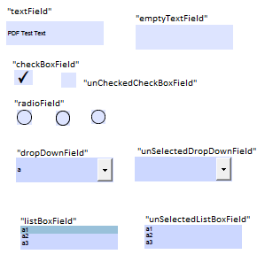
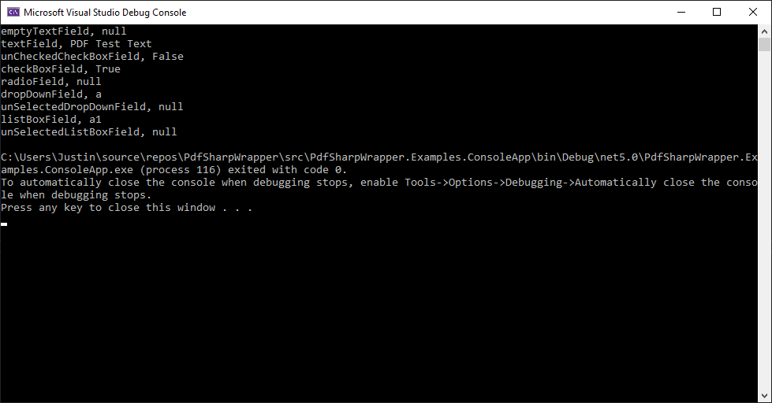

# PdfSharpWrapper

PdfSharpWrapper is a wrapper of PdfSharpCore that makes it easier to read and write values to PDF fields. Read and write to a PDF document using a dictionary where the key is the name of the PDF field and the value is the PDF field's value.

Example project: [Here](https://github.com/Just15/PdfSharpWrapper/blob/main/src/PdfSharpWrapper.Examples.ConsoleApp/Program.cs)

## Example Usage

**Read** a PDF document using TryRead() or Read().
```cs
PdfDocumentReader pdfDocumentReader = new PdfDocumentReader(loggerFactory.CreateLogger<PdfDocumentReader>());

Dictionary<string, string> dictionaryTryRead = pdfDocumentReader.TryRead(@"C:\Path\To\PdfFile.pdf");

Dictionary<string, string> dictionaryRead = pdfDocumentReader.Read(@"C:\Path\To\PdfFile.pdf");
```

**Write** to a PDF document using TryWrite() or Write().
```cs
PdfDocumentWriter pdfDocumentWriter = new PdfDocumentWriter(loggerFactory.CreateLogger<PdfDocumentWriter>());

bool successTryWrite = pdfDocumentWriter.TryWrite(@"C:\Path\To\PdfFile.pdf",  new Dictionary<string, string>
    {
        { "fieldName", "fieldValue" }
    });

bool successWrite = pdfDocumentWriter.Write(@"C:\Path\To\PdfFile.pdf",  new Dictionary<string, string>
    {
        { "fieldName", "fieldValue" }
    });
```

## Example Source



## Example Output



## :star: Powered By:
* [.NET](https://dotnet.microsoft.com/download)
* [NUKE Build](https://www.nuke.build/index.html)
* [PdfSharpCore](https://github.com/ststeiger/PdfSharpCore)
* [NUnit](https://nunit.org/)
* [Moq](https://github.com/moq/moq4)

## Free Online PFD Editor
https://www.pdfescape.com/open/

## License

Copyright (c) 2005-2007 empira Software GmbH, Cologne (Germany)  
Modified work Copyright (c) 2016 David Dunscombe

Permission is hereby granted, free of charge, to any person obtaining a copy of this software and associated documentation files (the "Software"), to deal in the Software without restriction, including without limitation the rights to use, copy, modify, merge, publish, distribute, sublicense, and/or sell copies of the Software, and to permit persons to whom the Software is furnished to do so, subject to the following conditions:

The above copyright notice and this permission notice shall be included in all copies or substantial portions of the Software.

THE SOFTWARE IS PROVIDED "AS IS", WITHOUT WARRANTY OF ANY KIND, EXPRESS OR IMPLIED, INCLUDING BUT NOT LIMITED TO THE WARRANTIES OF MERCHANTABILITY, FITNESS FOR A PARTICULAR PURPOSE AND NONINFRINGEMENT. IN NO EVENT SHALL THE AUTHORS OR COPYRIGHT HOLDERS BE LIABLE FOR ANY CLAIM, DAMAGES OR OTHER LIABILITY, WHETHER IN AN ACTION OF CONTRACT, TORT OR OTHERWISE, ARISING FROM, OUT OF OR IN CONNECTION WITH THE SOFTWARE OR THE USE OR OTHER DEALINGS IN THE SOFTWARE.